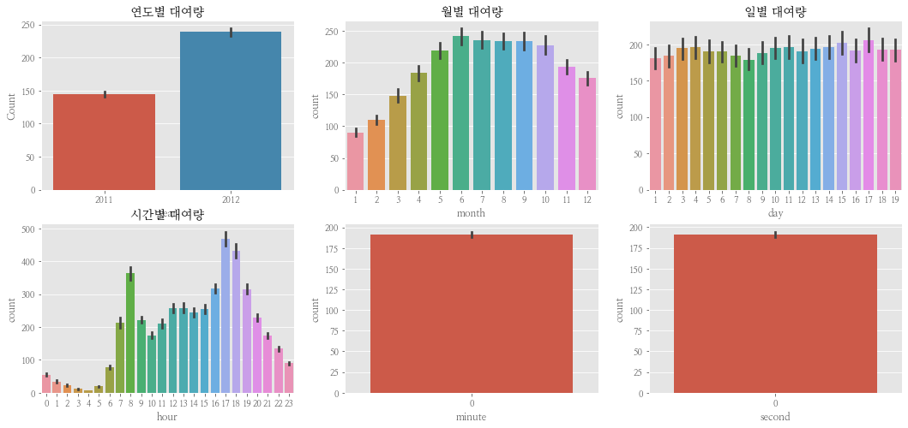
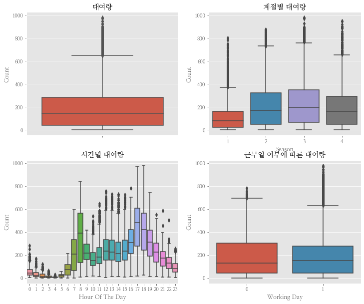
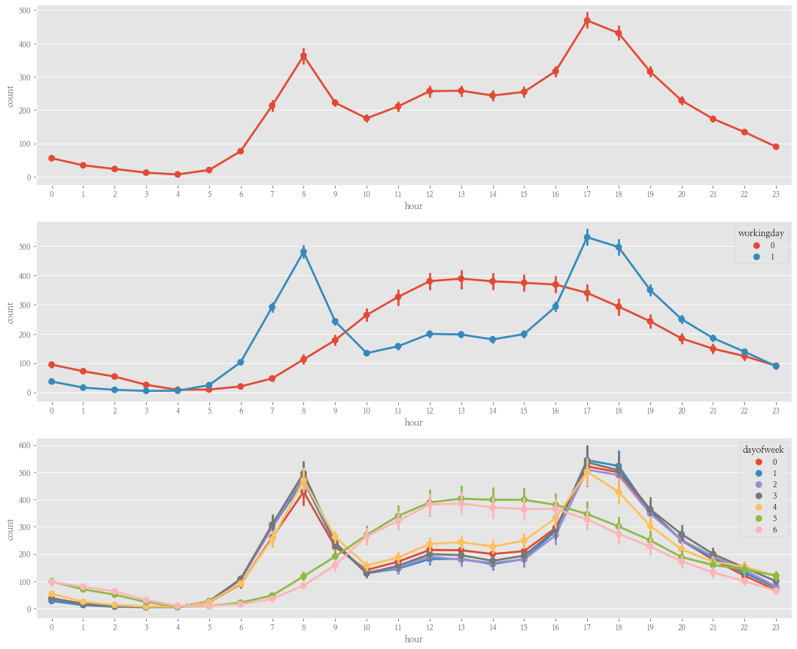
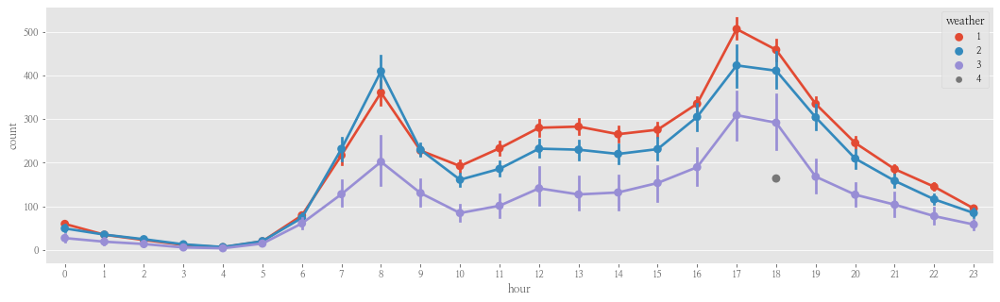
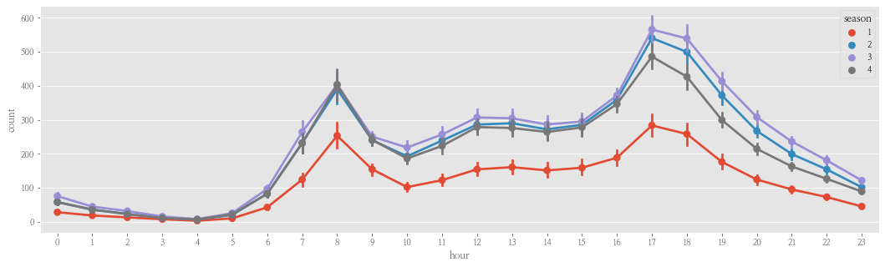
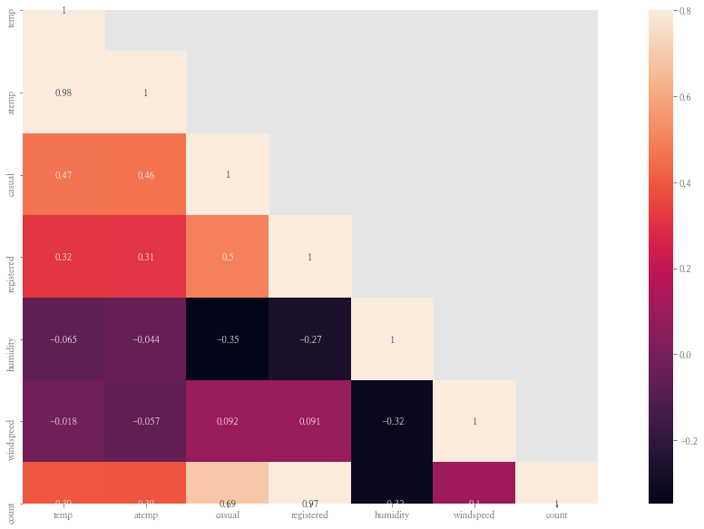
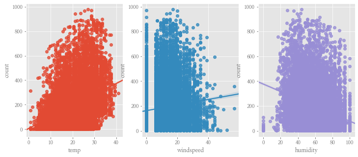
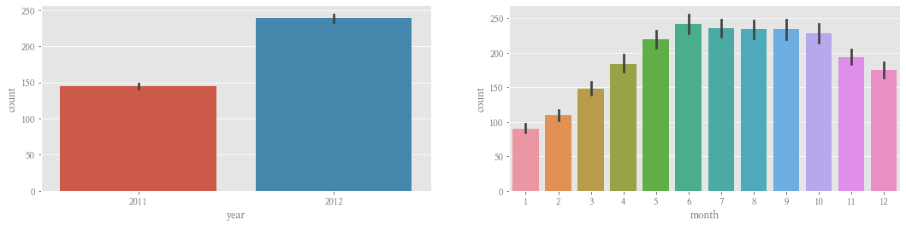
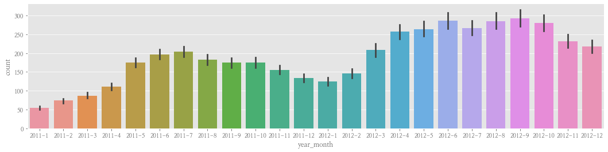

```python
import pandas as pd
import numpy as np
import matplotlib as mpl
import matplotlib.pyplot as plt
import seaborn as sns
from scipy import stats

# 노트북 안에 그래프를 그리기 위해
%matplotlib inline

# 그래프에서 격자로 숫자 범위가 눈에 잘 띄도록 ggplot 스타일을 사용
plt.style.use('ggplot')

# 그래프에서 마이너스 폰트 깨지는 문제에 대한 대처
mpl.rcParams['axes.unicode_minus'] = False

train = pd.read_csv('train.csv')
```

```python
# 1. 데이터 플레임을 불러와서 데이터 건수와 컬럼수를 표시
train.shape
```

    (10886, 12)

```python
# 2. 드레인 데이터의 각 항목에 대한 통계 및 데이터 유형을 조회
train.info()

```
    <class 'pandas.core.frame.DataFrame'>
    RangeIndex: 10886 entries, 0 to 10885
    Data columns (total 12 columns):
    datetime      10886 non-null object
    season        10886 non-null int64
    holiday       10886 non-null int64
    workingday    10886 non-null int64
    weather       10886 non-null int64
    temp          10886 non-null float64
    atemp         10886 non-null float64
    humidity      10886 non-null int64
    windspeed     10886 non-null float64
    casual        10886 non-null int64
    registered    10886 non-null int64
    count         10886 non-null int64
    dtypes: float64(3), int64(8), object(1)
    memory usage: 1020.7+ KB

```python
# 3-1. 트레인 데이터의 상위 5개 데이터를 불러와서 각 데이터의 세부 내용을 조회
train.head(5)
```
<table border="1" class="dataframe">
  <thead>
    <tr style="text-align: right;">
      <th></th>
      <th>datetime</th>
      <th>season</th>
      <th>holiday</th>
      <th>workingday</th>
      <th>weather</th>
      <th>temp</th>
      <th>atemp</th>
      <th>humidity</th>
      <th>windspeed</th>
      <th>casual</th>
      <th>registered</th>
      <th>count</th>
    </tr>
  </thead>
  <tbody>
    <tr>
      <td>0</td>
      <td>2011-01-01 00:00:00</td>
      <td>1</td>
      <td>0</td>
      <td>0</td>
      <td>1</td>
      <td>9.84</td>
      <td>14.395</td>
      <td>81</td>
      <td>0.0</td>
      <td>3</td>
      <td>13</td>
      <td>16</td>
    </tr>
    <tr>
      <td>1</td>
      <td>2011-01-01 01:00:00</td>
      <td>1</td>
      <td>0</td>
      <td>0</td>
      <td>1</td>
      <td>9.02</td>
      <td>13.635</td>
      <td>80</td>
      <td>0.0</td>
      <td>8</td>
      <td>32</td>
      <td>40</td>
    </tr>
    <tr>
      <td>2</td>
      <td>2011-01-01 02:00:00</td>
      <td>1</td>
      <td>0</td>
      <td>0</td>
      <td>1</td>
      <td>9.02</td>
      <td>13.635</td>
      <td>80</td>
      <td>0.0</td>
      <td>5</td>
      <td>27</td>
      <td>32</td>
    </tr>
    <tr>
      <td>3</td>
      <td>2011-01-01 03:00:00</td>
      <td>1</td>
      <td>0</td>
      <td>0</td>
      <td>1</td>
      <td>9.84</td>
      <td>14.395</td>
      <td>75</td>
      <td>0.0</td>
      <td>3</td>
      <td>10</td>
      <td>13</td>
    </tr>
    <tr>
      <td>4</td>
      <td>2011-01-01 04:00:00</td>
      <td>1</td>
      <td>0</td>
      <td>0</td>
      <td>1</td>
      <td>9.84</td>
      <td>14.395</td>
      <td>75</td>
      <td>0.0</td>
      <td>0</td>
      <td>1</td>
      <td>1</td>
    </tr>
  </tbody>
</table>

```python
# 3-2. 트레인 데이터의 상위 20개 데이터를 불러와서 각 데이터의 세부 내용을 조회
train.head(20)
```

<table border="1" class="dataframe">
  <thead>
    <tr style="text-align: right;">
      <th></th>
      <th>datetime</th>
      <th>season</th>
      <th>holiday</th>
      <th>workingday</th>
      <th>weather</th>
      <th>temp</th>
      <th>atemp</th>
      <th>humidity</th>
      <th>windspeed</th>
      <th>casual</th>
      <th>registered</th>
      <th>count</th>
    </tr>
  </thead>
  <tbody>
    <tr>
      <td>0</td>
      <td>2011-01-01 00:00:00</td>
      <td>1</td>
      <td>0</td>
      <td>0</td>
      <td>1</td>
      <td>9.84</td>
      <td>14.395</td>
      <td>81</td>
      <td>0.0000</td>
      <td>3</td>
      <td>13</td>
      <td>16</td>
    </tr>
    <tr>
      <td>1</td>
      <td>2011-01-01 01:00:00</td>
      <td>1</td>
      <td>0</td>
      <td>0</td>
      <td>1</td>
      <td>9.02</td>
      <td>13.635</td>
      <td>80</td>
      <td>0.0000</td>
      <td>8</td>
      <td>32</td>
      <td>40</td>
    </tr>
    <tr>
      <td>2</td>
      <td>2011-01-01 02:00:00</td>
      <td>1</td>
      <td>0</td>
      <td>0</td>
      <td>1</td>
      <td>9.02</td>
      <td>13.635</td>
      <td>80</td>
      <td>0.0000</td>
      <td>5</td>
      <td>27</td>
      <td>32</td>
    </tr>
    <tr>
      <td>3</td>
      <td>2011-01-01 03:00:00</td>
      <td>1</td>
      <td>0</td>
      <td>0</td>
      <td>1</td>
      <td>9.84</td>
      <td>14.395</td>
      <td>75</td>
      <td>0.0000</td>
      <td>3</td>
      <td>10</td>
      <td>13</td>
    </tr>
    <tr>
      <td>4</td>
      <td>2011-01-01 04:00:00</td>
      <td>1</td>
      <td>0</td>
      <td>0</td>
      <td>1</td>
      <td>9.84</td>
      <td>14.395</td>
      <td>75</td>
      <td>0.0000</td>
      <td>0</td>
      <td>1</td>
      <td>1</td>
    </tr>
    <tr>
      <td>5</td>
      <td>2011-01-01 05:00:00</td>
      <td>1</td>
      <td>0</td>
      <td>0</td>
      <td>2</td>
      <td>9.84</td>
      <td>12.880</td>
      <td>75</td>
      <td>6.0032</td>
      <td>0</td>
      <td>1</td>
      <td>1</td>
    </tr>
    <tr>
      <td>6</td>
      <td>2011-01-01 06:00:00</td>
      <td>1</td>
      <td>0</td>
      <td>0</td>
      <td>1</td>
      <td>9.02</td>
      <td>13.635</td>
      <td>80</td>
      <td>0.0000</td>
      <td>2</td>
      <td>0</td>
      <td>2</td>
    </tr>
    <tr>
      <td>7</td>
      <td>2011-01-01 07:00:00</td>
      <td>1</td>
      <td>0</td>
      <td>0</td>
      <td>1</td>
      <td>8.20</td>
      <td>12.880</td>
      <td>86</td>
      <td>0.0000</td>
      <td>1</td>
      <td>2</td>
      <td>3</td>
    </tr>
    <tr>
      <td>8</td>
      <td>2011-01-01 08:00:00</td>
      <td>1</td>
      <td>0</td>
      <td>0</td>
      <td>1</td>
      <td>9.84</td>
      <td>14.395</td>
      <td>75</td>
      <td>0.0000</td>
      <td>1</td>
      <td>7</td>
      <td>8</td>
    </tr>
    <tr>
      <td>9</td>
      <td>2011-01-01 09:00:00</td>
      <td>1</td>
      <td>0</td>
      <td>0</td>
      <td>1</td>
      <td>13.12</td>
      <td>17.425</td>
      <td>76</td>
      <td>0.0000</td>
      <td>8</td>
      <td>6</td>
      <td>14</td>
    </tr>
    <tr>
      <td>10</td>
      <td>2011-01-01 10:00:00</td>
      <td>1</td>
      <td>0</td>
      <td>0</td>
      <td>1</td>
      <td>15.58</td>
      <td>19.695</td>
      <td>76</td>
      <td>16.9979</td>
      <td>12</td>
      <td>24</td>
      <td>36</td>
    </tr>
    <tr>
      <td>11</td>
      <td>2011-01-01 11:00:00</td>
      <td>1</td>
      <td>0</td>
      <td>0</td>
      <td>1</td>
      <td>14.76</td>
      <td>16.665</td>
      <td>81</td>
      <td>19.0012</td>
      <td>26</td>
      <td>30</td>
      <td>56</td>
    </tr>
    <tr>
      <td>12</td>
      <td>2011-01-01 12:00:00</td>
      <td>1</td>
      <td>0</td>
      <td>0</td>
      <td>1</td>
      <td>17.22</td>
      <td>21.210</td>
      <td>77</td>
      <td>19.0012</td>
      <td>29</td>
      <td>55</td>
      <td>84</td>
    </tr>
    <tr>
      <td>13</td>
      <td>2011-01-01 13:00:00</td>
      <td>1</td>
      <td>0</td>
      <td>0</td>
      <td>2</td>
      <td>18.86</td>
      <td>22.725</td>
      <td>72</td>
      <td>19.9995</td>
      <td>47</td>
      <td>47</td>
      <td>94</td>
    </tr>
    <tr>
      <td>14</td>
      <td>2011-01-01 14:00:00</td>
      <td>1</td>
      <td>0</td>
      <td>0</td>
      <td>2</td>
      <td>18.86</td>
      <td>22.725</td>
      <td>72</td>
      <td>19.0012</td>
      <td>35</td>
      <td>71</td>
      <td>106</td>
    </tr>
    <tr>
      <td>15</td>
      <td>2011-01-01 15:00:00</td>
      <td>1</td>
      <td>0</td>
      <td>0</td>
      <td>2</td>
      <td>18.04</td>
      <td>21.970</td>
      <td>77</td>
      <td>19.9995</td>
      <td>40</td>
      <td>70</td>
      <td>110</td>
    </tr>
    <tr>
      <td>16</td>
      <td>2011-01-01 16:00:00</td>
      <td>1</td>
      <td>0</td>
      <td>0</td>
      <td>2</td>
      <td>17.22</td>
      <td>21.210</td>
      <td>82</td>
      <td>19.9995</td>
      <td>41</td>
      <td>52</td>
      <td>93</td>
    </tr>
    <tr>
      <td>17</td>
      <td>2011-01-01 17:00:00</td>
      <td>1</td>
      <td>0</td>
      <td>0</td>
      <td>2</td>
      <td>18.04</td>
      <td>21.970</td>
      <td>82</td>
      <td>19.0012</td>
      <td>15</td>
      <td>52</td>
      <td>67</td>
    </tr>
    <tr>
      <td>18</td>
      <td>2011-01-01 18:00:00</td>
      <td>1</td>
      <td>0</td>
      <td>0</td>
      <td>3</td>
      <td>17.22</td>
      <td>21.210</td>
      <td>88</td>
      <td>16.9979</td>
      <td>9</td>
      <td>26</td>
      <td>35</td>
    </tr>
    <tr>
      <td>19</td>
      <td>2011-01-01 19:00:00</td>
      <td>1</td>
      <td>0</td>
      <td>0</td>
      <td>3</td>
      <td>17.22</td>
      <td>21.210</td>
      <td>88</td>
      <td>16.9979</td>
      <td>6</td>
      <td>31</td>
      <td>37</td>
    </tr>
  </tbody>
</table>

```python
# 4. 기온 데이터를 describe로 조회
train['weather'].describe()
```

    count    10886.000000
    mean         1.418427
    std          0.633839
    min          1.000000
    25%          1.000000
    50%          1.000000
    75%          2.000000
    max          4.000000
    Name: weather, dtype: float64

```python
# 5. 트레인 데이터에 null인 데이터가 있는지 조회
train.isnull().sum()
```

    datetime      0
    season        0
    holiday       0
    workingday    0
    weather       0
    temp          0
    atemp         0
    humidity      0
    windspeed     0
    casual        0
    registered    0
    count         0
    dtype: int64

```python
# 6. 트레인 데이터의 datetime을 시각화해서 보기 편하게 년, 월, 일, 시간, 분, 초로 분해하여 트레인 데이터프레임에 다시 저장
from datetime import datetime
train = pd.read_csv('train.csv',  parse_dates=["datetime"])

train["year"] = train["datetime"].dt.year
train["month"] = train["datetime"].dt.month
train["day"] = train["datetime"].dt.day
train["hour"] = train["datetime"].dt.hour
train["minute"] = train["datetime"].dt.minute
train["second"] = train["datetime"].dt.second

train.shape
```

    (10886, 18)

```python
# 1 시간별 (년, 월, 일, 시간, 분, 초)에 따른 대여량을 시각화 해보자(x 시간값, y축 대여량) 

plt.rc('font', family='NanumMyeongjo') # 한글이 깨지는 현상을 막기 위해 폰트는 나눔명조로 변경

figure, ((ax1,ax2,ax3), (ax4,ax5,ax6)) = plt.subplots(nrows=2, ncols=3)
figure.set_size_inches(18,8)

sns.barplot(data=train, x="year", y="count", ax=ax1)
sns.barplot(data=train, x="month", y="count", ax=ax2)
sns.barplot(data=train, x="day", y="count", ax=ax3)
sns.barplot(data=train, x="hour", y="count", ax=ax4)
sns.barplot(data=train, x="minute", y="count", ax=ax5)
sns.barplot(data=train, x="second", y="count", ax=ax6)

ax1.set(ylabel='Count',title="연도별 대여량")
ax2.set(xlabel='month',title="월별 대여량")
ax3.set(xlabel='day', title="일별 대여량")
ax4.set(xlabel='hour', title="시간별 대여량")
```

    [Text(0.5, 0, 'hour'), Text(0.5, 1.0, '시간별 대여량')]



```python
# 2. 전체 대여량, 계절별 대여량, 시간별 대여량, 근무일에 따른 대여량을 시각화하라

fig, axes = plt.subplots(nrows=2,ncols=2)
fig.set_size_inches(12, 10)
sns.boxplot(data=train,y="count",orient="v",ax=axes[0][0])
sns.boxplot(data=train,y="count",x="season",orient="v",ax=axes[0][1])
sns.boxplot(data=train,y="count",x="hour",orient="v",ax=axes[1][0])
sns.boxplot(data=train,y="count",x="workingday",orient="v",ax=axes[1][1])

axes[0][0].set(ylabel='Count',title="대여량")
axes[0][1].set(xlabel='Season', ylabel='Count',title="계절별 대여량")
axes[1][0].set(xlabel='Hour Of The Day', ylabel='Count',title="시간별 대여량")
axes[1][1].set(xlabel='Working Day', ylabel='Count',title="근무일 여부에 따른 대여량")
```

    [Text(0, 0.5, 'Count'),
     Text(0.5, 0, 'Working Day'),
     Text(0.5, 1.0, '근무일 여부에 따른 대여량')]



```python
# 3. 트레인 데이터의 dayofweek 시각화해서 보기 편하게 년, 월,일, 시간, 분, 초로 분해하여 트레인 데이터 프레임에 다시 담아 조회한다.

train['dayofweek'] = pd.to_datetime(train['datetime']).dt.dayofweek
train.shape
```

    (10886, 19)

```python
# 4. 요일별 시간대별 대여량을 시각화
fig,(ax1,ax2,ax3)= plt.subplots(nrows=3)
fig.set_size_inches(18,15)

sns.pointplot(data=train, x="hour", y="count", ax=ax1)

sns.pointplot(data=train, x="hour", y="count", hue="workingday", ax=ax2)

sns.pointplot(data=train, x="hour", y="count", hue="dayofweek", ax=ax3)
```

    <matplotlib.axes._subplots.AxesSubplot at 0x7f8099a22048>



```python
#5. 날씨별, 시간별로 시각화
fig,(ax4)= plt.subplots(nrows=1)
fig.set_size_inches(18,5)

sns.pointplot(data=train, x="hour", y="count", hue="weather", ax=ax4)
```

    <matplotlib.axes._subplots.AxesSubplot at 0x7f8075ad0b00>



```python
# 6. 계절별, 시간별로 시각화
fig,(ax5)= plt.subplots(nrows=1)
fig.set_size_inches(18,5)

sns.pointplot(data=train, x="hour", y="count", hue="season", ax=ax5)
```

    <matplotlib.axes._subplots.AxesSubplot at 0x7f8099884160>



```python
#  7. 온도와 등록 사용자 여부, 습도, 풍속 데이터가 어떤 연관관계가 있는지 히트맵 시각화
corrMatt = train[["temp", "atemp", "casual", "registered", "humidity", "windspeed", "count"]]
corrMatt = corrMatt.corr()
print(corrMatt)

mask = np.array(corrMatt)
mask[np.tril_indices_from(mask)] = False

fig, ax = plt.subplots()
fig.set_size_inches(20,10)
sns.heatmap(corrMatt, mask=mask,vmax=.8, square=True,annot=True)
```

                    temp     atemp    casual  registered  humidity  windspeed  \
    temp        1.000000  0.984948  0.467097    0.318571 -0.064949  -0.017852   
    atemp       0.984948  1.000000  0.462067    0.314635 -0.043536  -0.057473   
    casual      0.467097  0.462067  1.000000    0.497250 -0.348187   0.092276   
    registered  0.318571  0.314635  0.497250    1.000000 -0.265458   0.091052   
    humidity   -0.064949 -0.043536 -0.348187   -0.265458  1.000000  -0.318607   
    windspeed  -0.017852 -0.057473  0.092276    0.091052 -0.318607   1.000000   
    count       0.394454  0.389784  0.690414    0.970948 -0.317371   0.101369   
    
                   count  
    temp        0.394454  
    atemp       0.389784  
    casual      0.690414  
    registered  0.970948  
    humidity   -0.317371  
    windspeed   0.101369  
    count       1.000000  

    <matplotlib.axes._subplots.AxesSubplot at 0x7f8075deacc0>



```python
# 8. 온도, 풍속, 습도에 대한 산점도 시각화 (regplot)

fig,(ax1,ax2,ax3) = plt.subplots(ncols=3)
fig.set_size_inches(12, 5)
sns.regplot(x="temp", y="count", data=train,ax=ax1)
sns.regplot(x="windspeed", y="count", data=train,ax=ax2)
sns.regplot(x="humidity", y="count", data=train,ax=ax3)
```

    <matplotlib.axes._subplots.AxesSubplot at 0x7f8075c2dc18>



```python
def concatenate_year_month(datetime):
    return "{0}-{1}".format(datetime.year, datetime.month)

train["year_month"] = train["datetime"].apply(concatenate_year_month)

print(train.shape)
train[["datetime", "year_month"]].head()
```

    (10886, 20)

<table border="1" class="dataframe">
  <thead>
    <tr style="text-align: right;">
      <th></th>
      <th>datetime</th>
      <th>year_month</th>
    </tr>
  </thead>
  <tbody>
    <tr>
      <td>0</td>
      <td>2011-01-01 00:00:00</td>
      <td>2011-1</td>
    </tr>
    <tr>
      <td>1</td>
      <td>2011-01-01 01:00:00</td>
      <td>2011-1</td>
    </tr>
    <tr>
      <td>2</td>
      <td>2011-01-01 02:00:00</td>
      <td>2011-1</td>
    </tr>
    <tr>
      <td>3</td>
      <td>2011-01-01 03:00:00</td>
      <td>2011-1</td>
    </tr>
    <tr>
      <td>4</td>
      <td>2011-01-01 04:00:00</td>
      <td>2011-1</td>
    </tr>
  </tbody>
</table>

```python
#  9. 년과 월 데이터를 붙여서 조회 (barplot) (2011~ 2012)

fig, (ax1, ax2) = plt.subplots(nrows=1, ncols=2)
fig.set_size_inches(18, 4)

sns.barplot(data=train, x="year", y="count", ax=ax1)
sns.barplot(data=train, x="month", y="count", ax=ax2)

fig, ax3 = plt.subplots(nrows=1, ncols=1)
fig.set_size_inches(18, 4)

sns.barplot(data=train, x="year_month", y="count", ax=ax3)
```

    <matplotlib.axes._subplots.AxesSubplot at 0x7f80743ce358>





